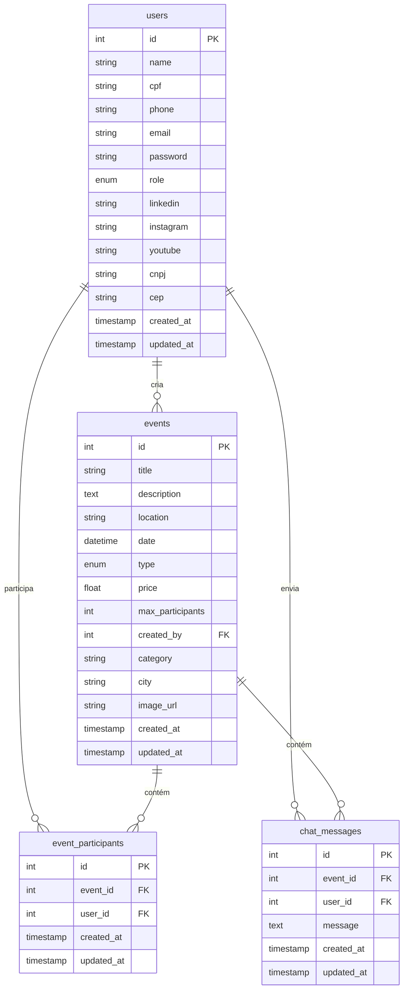
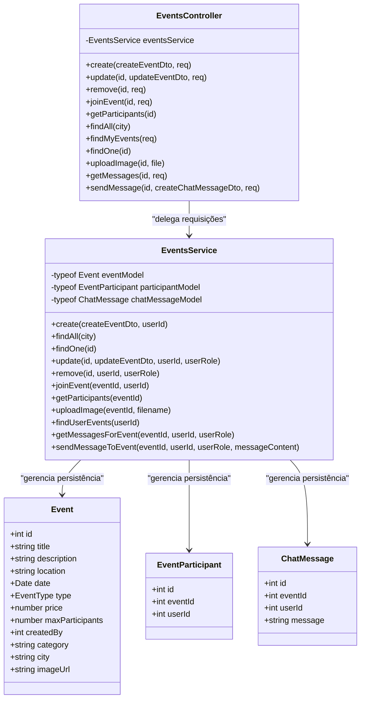

# Modelagem de Dados e Classes — ConVive

Este documento descreve a modelagem de entidades do banco de dados (DER) e o diagrama de classes principais do projeto **ConVive**.

---

## 1. Diagrama de Entidade-Relacionamento (DER)

O diagrama abaixo ilustra a estrutura de tabelas do banco de dados PostgreSQL (gerenciado através do Sequelize) e seus respectivos relacionamentos:

---

## 2. Diagrama de Classes

O diagrama de classes abaixo mostra as relações entre os principais componentes de negócio (Controllers, Services, Models e DTOs) do módulo de **Eventos** (`Events`):

